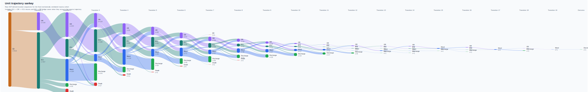

# CLIF Trauma Ventilation

This project builds the trauma ventilation cohort described in the PRD and writes analysis-ready outputs for:

- cohort membership and hospitalization outcomes
- ED and SICU phase windows
- ventilator setting change events
- first disposition after SICU
- summary tables for cohort flow, handoff differences, intervention rates, diagnoses, and outcomes
- collaborator-facing figures and an HTML report

## Public Preview

The current unit-trajectory sankey from the staged real-data report is embedded below so it is visible directly on the public GitHub repo page.



## Inputs

Place the CLIF tables below in one directory as `.csv`, `.csv.gz`, `.tsv`, or `.parquet` files named after the table. Both bare names like `adt.parquet` and CLIF export names like `clif_adt.parquet` are supported:

- `patient`
- `hospitalization`
- `hospital_diagnosis`
- `adt`
- `respiratory_support`
- `patient_assessments`

The pipeline also expects:

- a trauma ICD prefix file, for example [`config/trauma_icd_prefixes.example.csv`](/Users/davidbeiser/Documents/CLIF-Trauma/config/trauma_icd_prefixes.example.csv)
- an optional ADT location crosswalk, for example [`config/location_map.example.csv`](/Users/davidbeiser/Documents/CLIF-Trauma/config/location_map.example.csv)
- an optional diagnosis-name lookup, for example [`config/icd10cm_dictionary.csv`](/Users/davidbeiser/Documents/CLIF-Trauma/config/icd10cm_dictionary.csv)

## Usage

```bash
python3 -m venv .venv
source .venv/bin/activate
pip install -e .
clif-trauma \
  --input-dir /path/to/clif_tables \
  --output-dir /path/to/outputs \
  --trauma-code-set config/trauma_icd_prefixes.example.csv \
  --location-map config/location_map.example.csv
```

If editable reinstall is unavailable offline, run the package directly from source:

```bash
PYTHONPATH=src .venv/bin/python -m clif_trauma.cli \
  --input-dir /path/to/clif_tables \
  --output-dir /path/to/outputs \
  --trauma-code-set config/trauma_icd_prefixes.example.csv
```

After the base cohort outputs exist, build the collaborator report package:

```bash
PYTHONPATH=src .venv/bin/python -m clif_trauma.report \
  --output-dir /path/to/outputs \
  --input-dir /path/to/clif_tables \
  --location-map config/location_map.example.csv \
  --diagnosis-dictionary config/icd10cm_dictionary.csv
```

If the package is installed in editable mode, the same step is available as:

```bash
clif-trauma-report \
  --output-dir /path/to/outputs \
  --input-dir /path/to/clif_tables \
  --location-map config/location_map.example.csv \
  --diagnosis-dictionary config/icd10cm_dictionary.csv
```

## Outputs

The command writes CSV files under the requested output directory:

- `cohort.csv`
- `phase_windows.csv`
- `interventions.csv`
- `transfer_outcomes.csv`
- `assessment_context.csv`
- `summary/cohort_flow.csv`
- `summary/phase_intervention_summary.csv`
- `summary/handoff_summary.csv`
- `summary/outcome_summary.csv`
- `summary/transfer_summary.csv`
- `summary/direct_ed_to_sicu_phase_rates.csv`
- `summary/direct_ed_to_sicu_elapsed_hour_rates.csv`
- `summary/direct_ed_to_sicu_boarding_mortality.csv`
- `summary/direct_ed_to_sicu_imv_vs_boarding.csv`
- `summary/table1.csv`
- `summary/top_primary_diagnoses.csv`
- `figures/direct_ed_to_sicu_intervention_rates.svg`
- `figures/direct_ed_to_sicu_boarding_mortality.svg`
- `figures/direct_ed_to_sicu_imv_vs_boarding.svg`
- `figures/cohort_consort.svg`
- `figures/imv_trajectory_sankey.svg`
- `trauma_ventilation_report.html`

## Implementation Notes

- Trauma inclusion is diagnosis-based and driven by the supplied ICD prefix file.
- SICU detection uses ADT heuristics plus an optional site-reviewed crosswalk.
- The intubation anchor is the first invasive mechanical ventilation record in `respiratory_support`.
- Ventilator setting changes are counted only when a non-null value changes from the last carried-forward non-null value within the first IMV episode.
- Bridge locations between ED and SICU can update the carried-forward ventilator state, but they do not receive intervention counts.
- The hourly intervention figure for the direct `ED -> SICU` subgroup includes both raw mean rates and an upper-95% winsorized mean, plus the active-patient denominator by elapsed hour.
- The boarding-versus-IMV figure uses the direct `ED -> SICU` subgroup and reports observed first-episode IMV hours accumulated only in ED and ICU locations.
- The sankey plot keeps the broader final cohort, including `ED -> OR -> SICU` bridge cases, and derives trajectories from raw ADT sequences so `ICU -> OR -> ICU` returns are preserved.
- The top-diagnosis table joins a local diagnosis dictionary for human-readable names because the CLIF `hospital_diagnosis` extract does not carry a portable diagnosis-label field.

## Disclosure

This repository was developed with assistance from OpenAI Codex. Study design decisions, code review, interpretation, and final responsibility remain with the human investigators.
